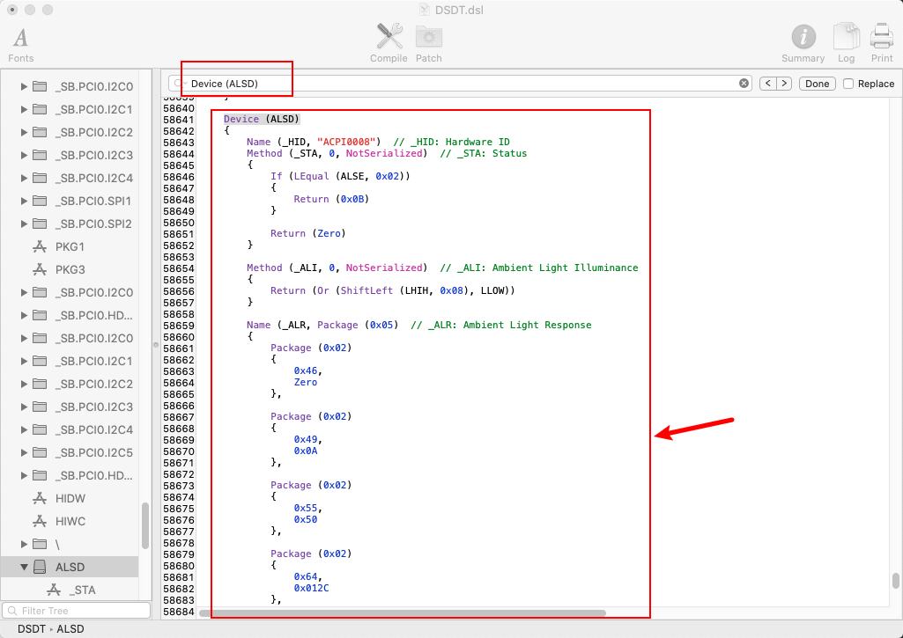

# 雷蛇灵刃 15 黑苹果


**警告：该教程仅为个人记录，该笔记本安装涉及解锁BIOS，存在一定风险，如您使用该教程对计算机进行更改，所造成的的任何后果我概不负责。**


# 写在最前

- 我主要参考了 [这篇](https://www.tonymacx86.com/threads/guide-razer-blade-15-2018-detailed-install-guide-high-sierra-10-13-6-17g2208-17g5019.264017/) 和 [这篇](https://github.com/stonevil/Razer_Blade_Advanced_early_2019_Hackintosh) 教程，感谢他们的辛苦付出 **(Thanks [stonevil](https://github.com/stonevil) and [vettz500](https://www.tonymacx86.com/members/vettz500.291395/))** 。部分内容为他们所写教程的汉化，详细或精简，我刚接触黑苹果，可能其中有部分问题，建议同时参考他们的教程。

- 因为新冠病疫情原因春节一直宅在家，学校假期也延长了，找到了同款笔记本的教程，所以入坑安装下黑苹果，最近把步骤整理了一下。
- 为什么买了这个笔记本？我的旧笔记本是 i5-7200U 的双核低压，内存也只有板载的 8G 不能拓展，性能捉急还经常爆内存。本来的打算再凑点钱买乞丐版的 XPS15 无显卡版（i7-9750H + 8G）。无意中看到了雷蛇灵刃15标准版的旧款在清仓（i7-8750H + 1060Max-Q + 16G），价钱比XPS丐版便宜不少还多个显卡和8G内存，我对显卡要求不大，Intel 牙膏挤得好CPU只是频率上低 0.1GHZ。
- 使用感受：这是我第一个雷蛇的产品，外观是很好看，我没有雷蛇信仰，灯什么的无所谓。下一次买笔记本还是要买大众一点的，冷门笔记本在驱动方面的确有点小问题，windows重装之后插耳机经常无法切换，在Linux（试了下 Ubuntu 和 Manjaro）下，都不能识别到耳机。有谁了解的话希望能帮助一下，感谢。


## 目录

- 硬件介绍
- 结果介绍
- 解锁BIOS
- 安装前准备
- 系统安装
- DSDT，SSDT制作
- 网卡
- 一些优化
- 参考
- 更新


## [1] 硬件介绍

|              |        型号         |                   最终情况                   |
| :----------: | :-----------------: | :------------------------------------------: |
|     CPU      |      i7-8750H       |                     可用                     |
|     GPU      |  Nvdia 1060 Max-Q   | 除 10.13 High Sierra 安装 WebDriver 外不可用 |
|     硬盘     | 更换了 金士顿 A2000 |                     可用                     |
|     网卡     |       9560NGW       |           WIFI 目前无解，蓝牙可用            |
|    显示器    |        1080P        |                     可用                     |
|    摄像头    |                     |                     可用                     |
|    扬声器    |                     |                     可用                     |
|    耳机    |                     |           无法检测到麦克风         |
|    麦克风    |                     |        不可用，已识别，但在设置中未看见输入电平        |
|    触控板    |                     |             手势可用（反应稍慢）             |
|  HDMI 接口   |                     |    直通显卡，除安装 High Sierra 外不可用     |
| Mini DP 接口 |                     |    直通显卡，除安装 High Sierra 外不可用     |
|    雷电3     |                     |   被识别成 USB3.1，可外接拓展坞外接显示器，我的电脑中需要删除SSDT-12-OptTabl.aml   |


## [2] 安装结果


### 一些小问题

我也是刚刚接触黑苹果，很多问题我也无法解决，有谁了解的话希望能帮助一下，感谢。

- ~~麦克风无法使用，系统能找到但无法使用，耳机麦克风无法找到。想要使用的话只能通过蓝牙耳机了。~~

- 耳机麦克无法识别。

- 输出设备默认识别到了扬声器和耳机（即使未插入耳机），无法自动切换，需手动切换。

  


### 2020-3-5 更新

今天本来想根据 [这篇文章](https://blog.daliansky.net/Use-AppleALC-sound-card-to-drive-the-correct-posture-of-AppleHDA.html) 尝试自己定制一下 `AppleALC` ，当我把有效节点和路径弄完之后，准备下载 [AppleALC-DEBUG](https://github.com/acidanthera/AppleALC/releases) 编译的时候，没想到最新版本已经添加了这个笔记本的 `layout-id:23`。


请按照如图修改，保存后重启。我的电脑耳机麦克风无法识别（我在 Ubuntu 下也无法找到耳机麦克风的有效节点信息）


## [3] 解锁BIOS

**解锁BIOS，存在一定风险，如您使用该教程对计算机进行更改，所造成的的任何后果我概不负责！！！**


雷蛇国内官网没有提供驱动和BIOS的下载，如有需要，需要访问美国官网。[点我。](https://support.razer.com/gaming-laptops/razer-blade-15-2018-base/)

该笔记本 DVMT 预分配默认为 32MB，不足以启动 MacOS，在 BIOS 中该设置项默认隐藏，所以要提取本机 BIOS 并且进行解锁，将 DVMT 预分配默认设置为 64MB（1080P），分辨率更高请分配更大空间。


**建议在 windows 下操作。**

### [3-1] 提取本机 BIOS

**注意备份好。**

打开 `AFUWINGUI.exe`，点击 Save 按钮，导出本机当前 BIOS 。


### [3-2] 修改 BIOS

- 打开 `AMIBCP.exe` ，点击 File -> open 打开导出的 BIOS。
- 如图，在左侧选择 / -> Setup -> Chipset，将左侧的 `System Agent Configuration` 的 Access 由 Default 修改为 USER


- 修改完后点击 File -> Save as。重命名为新的 BIOS。


### [3-3] 刷入新 BIOS

**！！！ 注意，该过程虽然简单，但有一定风险，造成的任何结果与本人无关。**


- 重新打开 AFUWINGUI.exe，点击 Open 打开刚刚修改后的 BIOS。

  


- 尽可能的退出其他程序，尽量保持后台干净，再点击 Flash 刷入新的 BIOS。


- 重启


## [4] 安装前准备

### [4-1] 准备macOS Catalina 安装盘

推荐使用[黑果小兵](https://blog.daliansky.net/)制作的镜像，使用 **TransMac** 制作（软件在文件夹中已提供）。[这里是10.15.3的镜像](https://blog.daliansky.net/macOS-Catalina-10.15.3-19D76-Release-version-with-Clover-5103-original-image-Double-EFI-Version.html)。

如果您要安装更新的系统，请升级 CLOVER，和 kexts/ 到对应兼容或更新的版本，可将制作好的安装盘中 `EFI/CLOVER` 的文件进行同名替换。（未来的新版本可能不可预知的问题，请酌情升级）。


### [4-2] 启动盘制作

请参考，或自行搜索，网上教程很多。[点我。](https://zhuanlan.zhihu.com/p/58630676)


## [5] 系统安装

### [5-1] BIOS 设置

- `Advanced`
  - `Thunderbolt(TM) Configuration`
    - `Security Level` 设置成 `No Security`

- `Chipset`
  - `System Agent (SA) Configuration`
    - `Graphics Configuration`
      - `DVMT Pre-Allocated`  设置成 `64`
      - `DVMT Total Gfx Mem`  设置成 `MAX`

- `Security`
  -  `Secure Boot` 设置成 `Disabled`

- `Boot`
  - `Fast Boot` 设置成 `Disabled`

  - `CSM Configuration`
    - `CSM Support` 设置成 `Disabled`


### [5-2] 安装过程

系统安装过程大致相同，选择U盘启动后进入安装。安装过程会重启几次。

可自行搜索，参考其他人的步骤。


### [5-3] 安装时可能出现的问题

显示程序副本已损坏

- 断网
- 打开终端
- 修改时间为系统发布对应的时间。

如修改为 2019年。输入 `date 000000002019`。


## [6] DSDT，SSDT制作

通过修补DSDT，SSDT驱动触控板，音频，电池状态，亮度控制等。


### [6-1] 准备修补

[6-1-1]

开机在 Clover 引导界面中按 `F4`，所需文件会加载到  `EFI/Clover/ACPI/origin` 中。通过 Clover Configurator 挂载启动的 EFI（通过U盘启动就挂载U盘）。


[6-1-2]

将 origin 文件夹复制到桌面，同时将 `iasl` 软件复制到文件夹中。

[6-1-3]

打开终端

```zsh
cd ~/Desktop
mkdir patched
./origin/iasl -da -dl DSDT.aml
```

[6-1-4]

打开 origin，使用 `MaciASL` 打开生成的 **DSDT.dsl** 文件。点击 Compile，确保没有错误。（默认应该没有 error，但有很多 warning，warning 不必关系，若有 error 请将 error 处代码注释或删除）

[6-1-5]

确保没有 errors 后，点击 Patch。


### [6-2] 修复电池

[1] 在弹窗的左侧点击  `_RehabMan Laptop/[bat]Razer Blade (2014)` ，等待右侧进行匹配后点击 Apply。

如果网络不好的话可能无法加载（github），请切换到合适的网络，或访问 [这里](https://github.com/RehabMan/Laptop-DSDT-Patch/blob/master/battery/battery_Razer-Blade-2014.txt)，或复制以下代码。


```txt
#Maintained by: RehabMan for: Laptop Patches
#battery_Razer-Blade-2014.txt

# created by sidelia 2016-01-17
# changes for Razer Blade Stealth (Kaby Lake) by BlenderSleuth (minor fixes by RehabMan)

# works for:
#  Razer Blade (2014)
#  Razer Blade Stealth (Kaby Lake), per BlenderSleuth
#  Razer Blade (14", late 2016)
#  Razer Blade Pro (2017)
#  Razer Blade 15 (2018), per JomanJi/blodtanner

into method label B1B2 remove_entry;
into definitionblock code_regex . insert
begin
Method (B1B2, 2, NotSerialized) { Return(Or(Arg0, ShiftLeft(Arg1, 8))) }\n
end;

into device label EC0 code_regex BIF1,\s+16, replace_matched begin IF10,8,IF11,8, end;
into device label EC0 code_regex BIF2,\s+16, replace_matched begin IF20,8,IF21,8, end;
into device label EC0 code_regex BIF3,\s+16, replace_matched begin IF30,8,IF31,8, end;
into device label EC0 code_regex BIF4,\s+16, replace_matched begin IF40,8,IF41,8, end;

into device label EC0 code_regex BST0,\s+16, replace_matched begin ST00,8,ST01,8, end;
into device label EC0 code_regex BST1,\s+16, replace_matched begin ST10,8,ST11,8, end;
into device label EC0 code_regex BST2,\s+16, replace_matched begin ST20,8,ST21,8, end;
into device label EC0 code_regex BST3,\s+16, replace_matched begin ST30,8,ST31,8, end;

into method label _BIF code_regex \^\^EC0\.BIF1, replaceall_matched begin B1B2(^^EC0.IF10,^^EC0.IF11), end;
into method label _BIF code_regex \^\^EC0\.BIF2, replaceall_matched begin B1B2(^^EC0.IF20,^^EC0.IF21), end;
into method label _BIF code_regex \^\^EC0\.BIF3, replaceall_matched begin B1B2(^^EC0.IF30,^^EC0.IF31), end;
into method label _BIF code_regex \^\^EC0\.BIF4, replaceall_matched begin B1B2(^^EC0.IF40,^^EC0.IF41), end;

into method label _BST code_regex \^\^EC0\.BST0, replaceall_matched begin B1B2(^^EC0.ST00,^^EC0.ST01), end;
into method label _BST code_regex \^\^EC0\.BST1, replaceall_matched begin B1B2(^^EC0.ST10,^^EC0.ST11), end;
into method label _BST code_regex \^\^EC0\.BST2, replaceall_matched begin B1B2(^^EC0.ST20,^^EC0.ST21), end;
into method label _BST code_regex \^\^EC0\.BST3, replaceall_matched begin B1B2(^^EC0.ST30,^^EC0.ST31), end;

# added for Razer Blade 15 (2018), per JomanJi
into device label EC0 code_regex BIF0,\s+16, replace_matched begin IF00,8,IF01,8, end;
into method label _BIF code_regex \(\^\^EC0.BIF0, replaceall_matched begin (B1B2(\^\^EC0.IF00,\^\^EC0.IF01), end;

# utility methods to read/write buffers from/to EC
into method label RE1B parent_label EC0 remove_entry;
into method label RECB parent_label EC0 remove_entry;
into device label EC0 insert
begin
Method (RE1B, 1, NotSerialized)\n
{\n
    OperationRegion(ERAM, EmbeddedControl, Arg0, 1)\n
    Field(ERAM, ByteAcc, NoLock, Preserve) { BYTE, 8 }\n
    Return(BYTE)\n
}\n
Method (RECB, 2, Serialized)\n
// Arg0 - offset in bytes from zero-based EC\n
// Arg1 - size of buffer in bits\n
{\n
    ShiftRight(Add(Arg1,7), 3, Arg1)\n
    Name(TEMP, Buffer(Arg1) { })\n
    Add(Arg0, Arg1, Arg1)\n
    Store(0, Local0)\n
    While (LLess(Arg0, Arg1))\n
    {\n
        Store(RE1B(Arg0), Index(TEMP, Local0))\n
        Increment(Arg0)\n
        Increment(Local0)\n
    }\n
    Return(TEMP)\n
}\n
end;

# buffer fields
into device label EC0 code_regex (ECCM,)\s+(256) replace_matched begin ECCX,%2,//%1%2 end;
into method label _BIF code_regex \(\^\^EC0.ECCM, replaceall_matched begin (^^EC0.RECB(0x60,256), end;
```

[2] 点击 Compile，确保没有错误。（默认情况下没有，不同版本BIOS可能情况不同）。


### [6-4] 修复重启保存背光亮度

[6-4-1]

在左侧菜单栏向下滑动，找到 `[gfx0] Disable/Enable on _WAK/_PTS (DSDT)`，点击都单击 Apply。

网络不好可点击 [这里](https://github.com/RehabMan/Laptop-DSDT-Patch/blob/master/graphics/graphics_PTS_WAK-disable.txt) 或复制以下代码。

```txt

#Maintained by: RehabMan for: Laptop Patches
#graphics_PTS_WAK-disable.txt

#
# The purpose of this patch is to add code to to _WAK
# that disables Radeon/nvidia on wake and add code
# to _PTS that enables it on _PTS.
#
# The path of _OFF may have to be customized to match your SSDTs
# The patch attempts to identify the correct _REG by using
# the ACPI PNP identifier for the EC.
#
# Use this patch if you experience trouble shutting down
# or restarting your laptop when disabling nvida/radeon.
#

into method label _PTS code_regex ([\s\S]*) replace_matched
begin
External(\\_SB.PCI0.PEG0.PEGP._ON, MethodObj)\n
If (CondRefOf(\\_SB.PCI0.PEG0.PEGP._ON)) { \\_SB.PCI0.PEG0.PEGP._ON() }\n
%1
end;

into method label _WAK code_regex (Return\s+\(.*) replace_matched
begin
External(\\_SB.PCI0.PEG0.PEGP._OFF, MethodObj)\n
If (CondRefOf(\\_SB.PCI0.PEG0.PEGP._OFF)) { \\_SB.PCI0.PEG0.PEGP._OFF() }\n
%1
end;
```

[6-4-2] 按 command + F 搜索 `Device (ALSD)`，找到如图代码，将其替换为以下代码。



```txt
Device (_SB.ALS0)
{
    Name (_HID, "ACPI0008")  // _HID: Hardware ID
    Name (_CID, "smc-als")  // _STA: Status
    Name (_ALI, 300)  // _ALI: Ambient Light Illuminance
    Name (_ALR, Package ()  // _ALR: Ambient Light Response
    {
    Package () { 100, 300 },
    })
}
```


### [6-3] 修复触控板

灵刃 15 的标准版和精英版使用的触控板不同，请根据自己的电脑进行选择修复方案。


#### [6-3-1] 标准版

[6-3-1-1]

继续搜索 `SSCN`。找到 Scope 为 `_SB.PCI0.I2C0` 下的 SSCN 方法。复制 SSCN 与 FMCN（在 SSCN 下方）这 两个方法。并将这两个方法如图重命名（也可选择删除）。


重命名为：


[6-3-1-3]

搜索 TPD0。将之前剪切的两个方法放到 `_INI` 方法后。


[6-3-1-4]

向下找到如下代码。


将其更改为如图。


#### [6-3-2] 精英版

[6-3-2-1]  

在 Patch 页面中粘贴以下代码代码，点击 Apply。

[6-3-2-2]

点击 Compile 进行编译确定无 error（默认没有）。

```txt
into method label _STA parent_label GPI0 replace_content begin
Return (0x0F)
end;

into_all method label _CRS parent_label TPD0 replace_content begin
ConcatenateResTemplate (SBFB, SBFI)
end;
```


### [6-4] 保存修改好的 DSDT.aml

- 点击 File -> save as 。

- File Format 选择 `ACPI Machine Language Binary`。命名为 DSDT.aml。存入桌面中的 parched 文件夹中。


### [6-5] 屏蔽 Nvdia 显卡

- **如果你选择安装 High Sierra 安装 WebDriver 使用 Nvidia 显卡的话，不用该补丁**。

[点击这里查看支持驱动的 High Sierra ]([https](https://www.tonymacx86.com/nvidia-drivers/) : [//www.tonymacx86.com/nvidia-drivers/](https://www.tonymacx86.com/nvidia-drivers/))

- **在的笔记本上使用该补丁会导致 type-c 转视频接口无信号，无法拓展显示器，若出现相同情况请删除该补丁。**


[6-5-1]

再次进入 origin 文件夹中，在终端输入

```shell
./origin/iasl -da -dl SSDT-12-OptTabl.aml
```

[6-5-2]

根据上方修补电池状态，触控板的方式类似，使用 MaciASL 打开 **SSDT-12-OptTabl.dsl**

[6-5-3]

 按 command + F 搜索以下代码

```txt
Method (_OFF, 0, Serialized)  // _OFF: Power Off
```


[6-5-4]

 在该代码上方，粘贴以下代码

```txt
Method (_INI) {_OFF() } // added to call _OFF
```

[6-5-5]

点击 patch，将以下代码粘贴到弹窗中，点击 apply。

```txt
into method label _INI parent_label \_SB.PCI0.GFX0 insert
begin
//added to turn nvidia/radeon off\n
External(\_SB.PCI0.PEG0.PEGP._OFF, MethodObj)\n
\n
end;
```

[6-5-6]

点击编译，出现一个错误。


[6-5-7]

搜索一下代码，并将其删除，再次编译。

```shell
External (_SB_.PCI0.PEG0.TGPC, IntObj)    // (from opcode)
```


[6-5-8]

点击 File -> Save As。将最终的 /aml 文件保存。


### [6-6] 制作 SSDT-USBX.aml

如果想制作自己的 SSDT-USBX.aml。请参考 [点我。](https://github.com/stonevil/Razer_Blade_Advanced_early_2019_Hackintosh#usb-mapping)

使用 USBMap。[点我](https://github.com/corpnewt/USBMap)


### [6-7] 复制提供的的 .aml 文件

将文件夹中的 SSDT-PNLF.aml，SSDT-UIAC-ALL.aml，SSDT-USBX.aml，SSDT-XOSI.aml 同上面修补的两个文件一同放入 patched 文件夹中，最后 patched 文件夹中应该有如下6个文件。

**如果 type-c 转视频接口无信号，请删除SSDT-12-OptTabl.aml**


## [7] 网卡

### [7-1] 更换博通网卡

在网上找过拆机图，网卡附近的位置还是挺多的，我的选择是拆机的 `BCM94360cs2` + 转接卡，可直接免驱使用。

相比使用原装的网卡位置稍有点高，压在一根的排线上，但是不影响，如选择同款网卡，请注意绝缘，建议上螺丝的时候不要拧太紧，不松动即可。装上之后的效果如图。

**小提示: **拧螺丝前最好把易碎贴给清理干净。这个贴纸分量太足，卡在螺丝孔中导致一直滑丝。


**使用效果: **2.4G WIFI 和 蓝牙有干扰，尤其是 2.4G WIFI 使用带宽高的时候，蓝牙几乎不能用。其他使用场景基本良好。


- 想折腾的话可选择 `DW1820A`，可参考 [这里。](https://blog.daliansky.net/DW1820A_BCM94350ZAE-driver-inserts-the-correct-posture.html)

- 博通 `BCM94352Z` ，现在价钱被炒的很高，目前将近 300，有钱随意。


### [7-2] 使用自带网卡

Intel 蓝牙默认免驱，WiFi 目前无解。

蓝牙从 windows 重启进入 macOS 可使用（网卡未断电所以上传了驱动）。

将 [该驱动](https://github.com/zxystd/IntelBluetoothFirmware/releases) 放入 EFI/CLOVER/kexts，可以实现冷启动驱动自带网卡蓝牙。


**使用效果: **蓝牙键盘，蓝牙音箱没有问题，蓝牙鼠标貌似不能用。


### [7-3] 使用USB网卡

usb 网卡驱动安装。[点我。](https://github.com/chris1111/Wireless-USB-Adapter-Clover/releases)

- COMFAST  CF-WU815N  150M 单频
- COMFAST  CF-811AC  650M 双频
- COMFAST  CF-812AC  1300M 双频
- 更多其他型号自行搜索


## [8] 一些优化

### [8-1] HIDPI

开启 HIDPI 后可能会导致开机第二阶段 Logo 变大，因为分辨率是仿冒的，不影响使用。

使用终端执行：

```zsh
sh -c "$(curl -fsSL https://raw.githubusercontent.com/xzhih/one-key-hidpi/master/hidpi.sh)"
```

- 选择 "开启 HIDPI"

- 显示的 ICON 选择 Macbook Pro（在设置界面显示的样式）
- 选择分辨率配置 1080P 显示器（根据自身情况选择）

更多详细情况可参考这篇文章。[点我。](https://www.sqlsec.com/2018/09/hidpi.html)


### [8-2] 打开 TRIM

如果使用 SSD，一定要打开 TRIM，防止系统多次擦写，确保硬盘寿命。

```zsh
sudo trimforce enable
```

完成后系统会进行一次重启。


### [8-3] 禁用睡眠

在终端运行以下命令，并在 设置 -> 节能 中关闭相应设置。

```zsh
sudo pmset -a hibernatemode 0

sudo rm /var/vm/sleepimage

sudo mkdir /var/vm/sleepimage
```


### [8-4] “洗白”序列号

网络上已经有很多教程，自行搜一下。


# 参考

- https://github.com/stonevil/Razer_Blade_Advanced_early_2019_Hackintosh
- https://www.tonymacx86.com/threads/guide-razer-blade-15-2018-detailed-install-guide-high-sierra-10-13-6-17g2208-17g5019.264017/
- https://blog.daliansky.net/


# 更新

### 2020-3-5

- 更新 `AppleALC` 版本到 1.4.7，包含修补后的 layout-id: 23。内置麦克风可用。